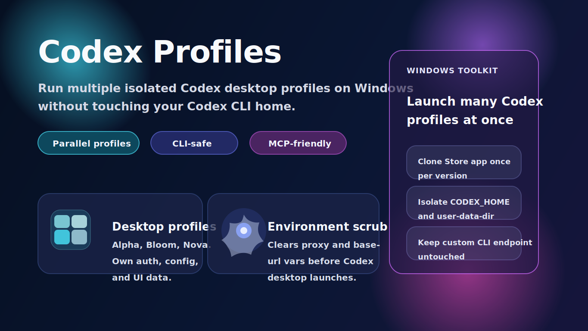
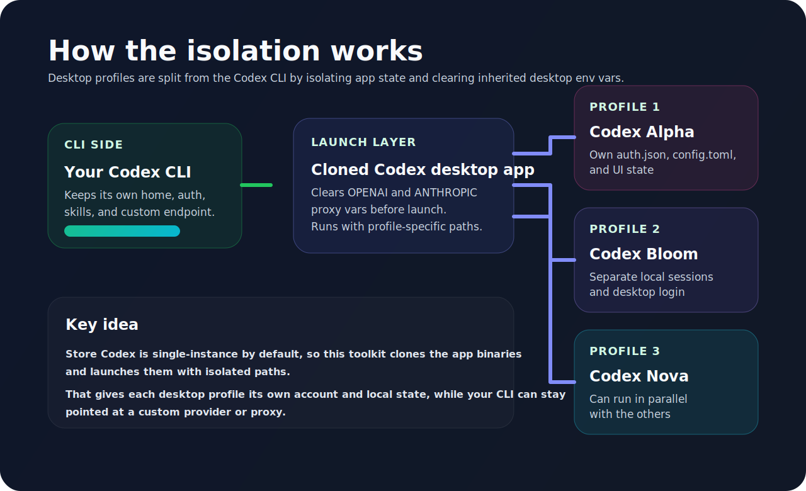

# Codex Profiles

<p align="center">
  
</p>

<p align="center">
  
  
  
  
</p>

Windows helpers for running multiple isolated Codex desktop profiles in parallel without touching your Codex CLI home.

## About

`Codex Profiles` is a Windows-focused helper toolkit for people who want multiple Codex desktop identities at the same time without breaking a separate Codex CLI setup.

It is built for setups where you want things like:

- one desktop profile per account or workspace
- parallel Codex windows with isolated local state
- desktop auth separated from a CLI that uses a custom endpoint
- optional MCP defaults for new desktop profiles

## Visual overview



## What this solves

The Microsoft Store Codex desktop app behaves like a single-instance Electron app. Launching the Store app directly does **not** give you true parallel profile isolation.

This repo works around that by:

- detecting the installed `OpenAI.Codex` Store package
- cloning the desktop app binaries into `%LOCALAPPDATA%\\CodexParallelDesktop\\versions\\<version>`
- launching each profile with its own `CODEX_HOME`
- launching each profile with its own Chromium `--user-data-dir`
- scrubbing inherited proxy / API environment variables before the desktop app starts

That keeps desktop profiles separate from each other while leaving the Codex CLI home alone.

## What gets isolated

Per profile, this setup isolates local desktop state such as:

- `config.toml`
- `auth.json`
- sessions, memories, skills, sqlite files
- Chromium / Electron UI state
- logged-in desktop account state for that profile

By default, profiles live under:

- profile home: `%LOCALAPPDATA%\\CodexProfiles\\<profile>`
- UI data: `%LOCALAPPDATA%\\CodexParallelDesktop\\ui\\<profile>`

## Requirements and limits

This repo is designed for the same setup used in testing:

- Windows with the Codex desktop app installed from the Microsoft Store
- PowerShell 5.1 or newer
- Node.js only if you want to use `-EnableCommonMcp`

What should work reliably:

- multiple cloned Codex desktop profiles in parallel
- isolated desktop `CODEX_HOME` and isolated Chromium `--user-data-dir`
- desktop launchers that ignore inherited `OPENAI_BASE_URL` / proxy env vars
- keeping the normal Codex CLI home separate from the desktop profiles

What is still environment-dependent:

- future Codex desktop app updates could change internal behavior
- some MCP OAuth credentials may still be stored in the Windows credential store
- launching the normal Store app icon directly bypasses these isolated launchers

## Important caveats

- This does **not** modify `%USERPROFILE%\\.codex`, so Codex CLI stays on its own home unless you change it yourself.
- If you launch the normal Store app directly, it still inherits your normal Windows environment. If your machine has `OPENAI_BASE_URL` or similar user env vars set, the normal Store app can still use them.
- Some MCP OAuth credentials may still live in the Windows credential store outside `CODEX_HOME`. File-based profile state is isolated, but OS keychain-backed credentials can still be shared depending on how Codex stores them.

## Quick start

### 1. Clone the repo

```powershell
git clone https://github.com/ychampion/codex-profiles
cd codex-profiles
```

### 2. Create common named profiles

```powershell
powershell -ExecutionPolicy Bypass -File .\scripts\windows\Install-CodexDesktopProfiles.ps1 -ProfileName alpha,bloom,apex,prime,flow,turbo,sonic,nova -CreateDesktopShortcuts -CreateStartMenuShortcuts
```

### 3. Launch a specific profile

```powershell
powershell -ExecutionPolicy Bypass -File .\scripts\windows\Start-CodexDesktopProfile.ps1 -ProfileName alpha -DisplayName "Codex Alpha"
```

### 4. Create one profile with optional local MCP defaults

```powershell
powershell -ExecutionPolicy Bypass -File .\scripts\windows\New-CodexDesktopProfile.ps1 -ProfileName alpha -DisplayName "Codex Alpha" -EnableCommonMcp -CreateDesktopShortcut
```

You can append `-WhatIf` to the public scripts or module functions for a dry run. The installer also accepts comma-separated profile names when invoked through `powershell -File`.

## Included scripts

- `scripts/windows/New-CodexDesktopProfile.ps1` creates one isolated profile and optional shortcuts
- `scripts/windows/Start-CodexDesktopProfile.ps1` launches one isolated profile
- `scripts/windows/Install-CodexDesktopProfiles.ps1` provisions a set of named profiles

## Optional MCP defaults

`-EnableCommonMcp` bootstraps a minimal local config with:

- ChatGPT login mode
- OpenAI model provider
- Windows elevated sandbox setting
- optional local `npx`-backed MCP entries for Playwright, Chrome DevTools, and Context7

The MCP block is created only when a new profile config is written, or when you pass `-OverwriteConfig`.

## Troubleshooting

### Microsoft Store app updates

If the Codex desktop app updates through the Microsoft Store, the installed app version can change while your older cloned binaries stay on disk.

In that case, rerun a launcher with `-ForceRefreshClone` to rebuild the clone from the latest Store version:

```powershell
powershell -ExecutionPolicy Bypass -File .\scripts\windows\Start-CodexDesktopProfile.ps1 -ProfileName alpha -ForceRefreshClone
```

You can also refresh all provisioned profiles in one pass:

```powershell
powershell -ExecutionPolicy Bypass -File .\scripts\windows\Install-CodexDesktopProfiles.ps1 -ProfileName alpha,bloom,apex,prime,flow,turbo,sonic,nova -ForceRefreshClone
```

This refreshes the cloned app binaries. Your isolated profile data still lives in the profile home and UI data folders, so it should not reset your desktop profiles by itself.

### MCP auth and OAuth prompts

Profile-local config is isolated, but some MCP authentication flows can still involve the Windows credential store.

That means file-based profile state is separate, while some MCP credentials may be reused or re-prompted depending on the provider.

If an MCP server shows the wrong account, keeps prompting, or behaves differently across profiles:

- reconnect that MCP server from the profile you actually want to use
- if needed, remove the matching Codex or provider-specific entry from Windows Credential Manager and sign in again from the target profile
- expect some providers to reuse OS-level credentials, even when `CODEX_HOME` is isolated

For that reason, local profile separation is strongest for desktop auth, config, sessions, and UI data. MCP OAuth behavior can still vary by provider.

## Recommended naming set

The default profile set used by the installer is:

- `alpha`
- `bloom`
- `apex`
- `prime`
- `flow`
- `turbo`
- `sonic`
- `nova`

## Verification

The launchers are designed to avoid inherited desktop proxy settings such as:

- `OPENAI_BASE_URL`
- `OPENAI_API_KEY`
- `OPENAI_ORG_ID`
- `OPENAI_PROJECT_ID`
- `ANTHROPIC_BASE_URL`
- `ANTHROPIC_API_KEY`
- `ANTHROPIC_AUTH_TOKEN`
- `CODEX_THREAD_ID`

That is important when your CLI or shell uses a custom local endpoint but you want the desktop profiles to sign in with ChatGPT normally.
